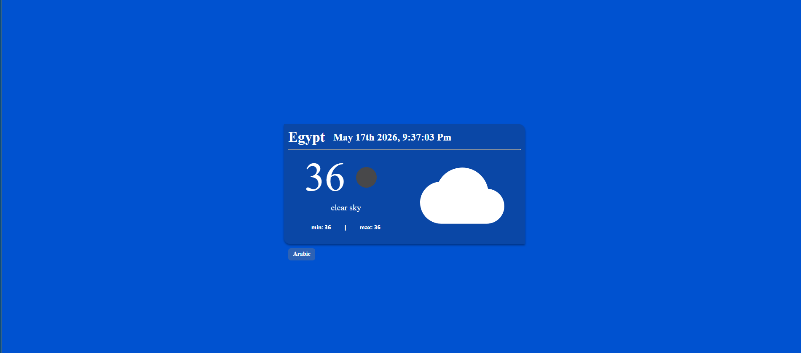

# 🌤️ React Weather App (i18n + MUI + OpenWeather)

A modern weather application built with React that displays real-time weather data using the OpenWeatherMap API. The app supports English and Arabic languages with full RTL/LTR switching.

## 🌐 Live Demo
[Click Here](https://luxury-zuccutto-02fc96.netlify.app/)

## 📸 Preview



---

🚀 Features
🌍 Real-time weather data (OpenWeather API)
🧠 Global state management using Redux Toolkit
⚡ Async data fetching with createAsyncThunk
🌐 Multi-language support (English / Arabic)
🔄 Dynamic language switching
⏰ Live date & time with Moment.js
🎨 Material UI responsive design
📱 RTL / LTR layout support
🧩 Clean and scalable architecture

---

## 🛠️ Tech Stack

* React.js
* Redux Toolkit
* React-Redux
* Material UI (MUI)
* Axios
* react-i18next
* Moment.js
* OpenWeatherMap API

---

## 📁 Project Structure

```
src/
├── App.js
├── index.js
├── store/
├── features/
│   └── weather/
├── i18n.js
├── styles/
├── components/
└── assets/

---

## 🌦️ API Usage

This project uses OpenWeatherMap API:

```
https://api.openweathermap.org/data/2.5/weather
```

> Make sure to replace the API key with your own in production.

---

## 📦 Installation

```bash
git clone <repo-url>
cd weather-app
npm install
npm start
```

---

## 🌍 Internationalization

The app supports:

* 🇺🇸 English
* 🇪🇬 Arabic

Language switching is handled dynamically using `react-i18next`.

---
🧠 State Management (Redux Toolkit)

The app uses Redux Toolkit for:

Centralized weather state
Async API calls using createAsyncThunk
Loading state handling
Clean separation between UI and logic

## ⚠️ Notes

* API key should be stored in `.env` for security
* Moment locale updates automatically based on selected language
* App uses funct
